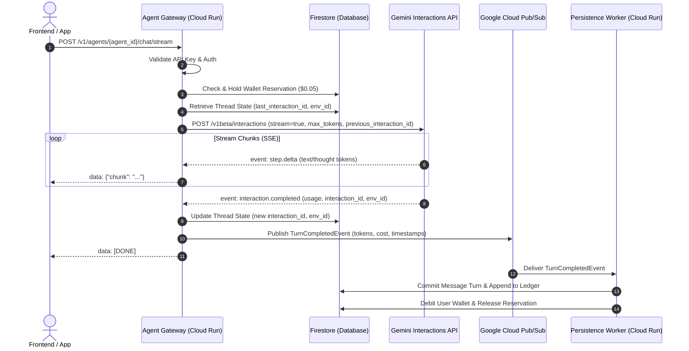

# Technical Architecture: Managed Agents Middleware

This document details the internal design and data flow of the Managed Agents Middleware stack.

---

## 1. High-Level Architecture Overview



---

## 2. Gemini Interactions API Integration

### Endpoint Details
- **Endpoint**: `POST https://generativelanguage.googleapis.com/v1beta/interactions`
- **Auth**: `x-goog-api-key: $GEMINI_API_KEY` (or Google OAuth Bearer Token via ADC)
- **Base Agent**: `antigravity-preview-09-2026`
- **Default Model**: `gemini-3.8-flash`

### Request Payload Example:
```json
{
  "agent": "antigravity-preview-09-2026",
  "input": "Analyze the sales numbers and plot a chart.",
  "stream": true,
  "agent_config": {
    "type": "antigravity",
    "model": "gemini-3.8-flash",
    "max_total_tokens": 50000
  },
  "previous_interaction_id": "interactions/int_abc123",
  "environment": "environments/env_xyz456"
}
```

---

## 3. Token Tracking & Billing Normalization

The Google Interactions API returns usage metrics in the following envelope:
```json
{
  "usage": {
    "total_input_tokens": 1250,
    "total_output_tokens": 340,
    "total_thought_tokens": 180,
    "cached_content_token_count": 0,
    "total_tokens": 1770
  }
}
```

### Mapping & Rate Calculations (`gemini-3.8-flash`):
* **Prompt Input**: `total_input_tokens` $\times$ $\$0.75 / 1,000,000$ tokens
* **Output + Thinking**: (`total_output_tokens` $+$ `total_thought_tokens`) $\times$ $\$3.75 / 1,000,000$ tokens
* **Cached Tokens**: Discounted prompt rate if applicable.

The calculation is executed in `usage_metadata.py` and converted to nano-cents (`credit_nanos`) to ensure 100% mathematical precision with zero rounding drift.

---

## 4. Multi-Turn Thread Memory

When a user initiates a conversation:
1. **Turn 1**: The request has no `previous_interaction_id`. Google boots an isolated Linux sandbox environment and returns an initial `interaction.id` and `environment_id`.
2. **Persistence**: The Gateway records `last_interaction_id` and `environment_id` directly in the Firestore `threads` document.
3. **Turn 2+**: When the user follows up in the same thread, the Gateway injects:
   - `"previous_interaction_id": thread["last_interaction_id"]`
   - `"environment": thread["environment_id"]`
4. This preserves all context, reasoning history, workspace files, and bash state inside Google's managed sandbox!

---

## 5. Budget Protection & Safeguards

- **`max_total_tokens`**: The middleware passes a strict token ceiling to Google. If an autonomous loop runs long, Google halts execution at the threshold and returns `status: "incomplete"`.
- **Prepaid Reservation**: The Gateway holds a tiny temporary reservation ($0.05) before dispatching requests. If a user's wallet balance reaches zero, requests are blocked immediately before contacting Google.
